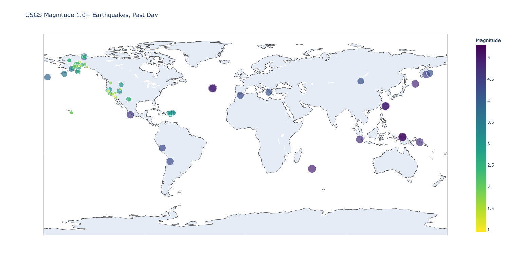

# Data-Visualizations---Global-Earthquake
I'll analyze a data set representing all the earthquakes that have occurred in the world during a time window. Then i'll make a map showing the location of these earthquakes and how significant each one was. I'll use the data in the JSON format.

